# 🔍 Juicy Details - TryHackMe: SOC Analyst Investigation Walkthrough
### *A Deep-Dive Learning Journal on Log Analysis & Incident Response*

> **📋 Metadata**
> - **Author**: alxyz09
> - **Role**: Student | Software Engineer | Pentester | Bug Hunter
> - **Platform**: TryHackMe - Juicy Details Room
> - **Difficulty**: Medium
> - **Topic**: SOC Analyst, Log Analysis, Incident Response, Web Application Security
> - **Date**: February 2026
> - **Status**: ✅ Completed

---

## 📚 Table of Contents
```
1. Pendahuluan & Latar Belakang
2. Tujuan Pembelajaran
3. Environment & Tools yang Digunakan
4. Metodologi Investigasi
5. Step-by-Step Analysis
   5.1. Fase 1: Initial Reconnaissance & Log Familiarization
   5.2. Fase 2: Identifikasi Attack Tools & Signature Detection
   5.3. Fase 3: Endpoint Vulnerability Mapping
   5.4. Fase 4: Data Exfiltration & Credential Theft Analysis
   5.5. Fase 5: Post-Exploitation & Persistence Tracking
6. Attack Timeline Reconstruction
7. Indicators of Compromise (IOCs)
8. Mitigation & Hardening Recommendations
9. Lessons Learned & Personal Reflections
10. References & Further Reading
```

---

## 1. 🎯 Pendahuluan & Latar Belakang

Dalam dunia keamanan siber modern, kemampuan untuk menganalisis log sistem dan jaringan merupakan salah satu kompetensi paling fundamental yang harus dimiliki oleh seorang Security Operations Center (SOC) Analyst. Tidak cukup hanya memahami teori tentang serangan siber, seorang analis harus mampu "membaca cerita" yang tersembunyi di balik jutaan baris log, mengidentifikasi pola yang mencurigakan, dan merekonstruksi urutan kejadian dari sebuah insiden keamanan.

Room **Juicy Details** dari platform TryHackMe hadir sebagai simulasi realistis yang menantang peserta untuk berperan sebagai SOC Analyst yang sedang menangani insiden kompromi pada sebuah aplikasi web e-commerce fiktif bernama "Juicy Shop". Dalam skenario ini, kita diberikan akses ke berbagai file log dari server yang diduga telah diserang, dan tugas kita adalah melakukan investigasi forensik digital untuk menjawab serangkaian pertanyaan investigatif.

Melalui walkthrough ini, saya akan mendokumentasikan proses berpikir, metodologi, command-line analysis, serta interpretasi hasil yang saya lakukan selama mengerjakan lab ini. Dokumen ini saya susun dengan gaya naratif yang agak panjang dan reflektif, karena menurut saya proses belajar yang mendalam justru terjadi ketika kita meluangkan waktu untuk menjelaskan *mengapa* kita melakukan sesuatu, bukan hanya *apa* yang kita lakukan.

> 💭 **Personal Note**: Sebagai seseorang yang sedang mendalami jalur Blue Team, saya merasa sangat penting untuk tidak hanya terfokus pada "mencari flag" atau menjawab soal dengan cepat. Yang lebih berharga adalah membangun intuisi analitis: bagaimana mengenali anomali, bagaimana menghubungkan titik-titik data yang terpisah, dan bagaimana menyampaikan temuan dalam bahasa yang dapat dipahami oleh stakeholder teknis maupun non-teknis.

---

## 2. 🎓 Tujuan Pembelajaran

Sebelum memulai investigasi, saya menetapkan beberapa tujuan pembelajaran pribadi yang ingin saya capai melalui room ini:

| No | Tujuan Pembelajaran | Relevansi dengan Peran SOC Analyst |
|----|---------------------|-----------------------------------|
| 1 | Memahami struktur dan format berbagai jenis log (Apache access log, Linux auth log, vsftpd log) | Kemampuan parsing dan interpretasi log adalah core skill SOC L1 |
| 2 | Mengidentifikasi signature tools offensive security dalam log traffic | Deteksi early-stage reconnaissance & automated attacks |
| 3 | Menganalisis pola serangan brute-force dan SQL injection dari perspektif defensif | Membangun rule deteksi untuk SIEM/WAF |
| 4 | Merekonstruksi timeline serangan berdasarkan timestamp log | Incident timeline building untuk laporan forensik |
| 5 | Mengekstrak Indicators of Compromise (IOCs) yang dapat ditindaklanjuti | Threat intelligence sharing & proactive hunting |
| 6 | Merumuskan rekomendasi mitigasi berbasis bukti temuan | Bridging gap antara detection dan prevention |

---

## 3. 🛠️ Environment & Tools yang Digunakan

Untuk menjaga konsistensi dan reproducibility analysis, berikut adalah spesifikasi environment dan tools yang saya gunakan selama investigasi:

### 3.1. System Environment
```bash
$ uname -a
Linux al-dev 5.15.0-91-generic #101-Ubuntu SMP x86_64 GNU/Linux

$ cat /etc/os-release
NAME="Ubuntu"
VERSION="22.04.3 LTS (Jammy Jellyfish)"
```

### 3.2. Tools Utama
| Tool | Version | Purpose dalam Investigasi |
|------|---------|---------------------------|
| `grep` | GNU grep 3.7 | Pattern matching & filtering log entries |
| `awk` | GNU Awk 5.1.0 | Field extraction & data transformation |
| `cut` | GNU coreutils 8.32 | Column-based log parsing |
| `sort` / `uniq` | GNU coreutils 8.32 | Aggregation & deduplication analysis |
| `less` / `tail` / `head` | GNU coreutils 8.32 | Navigasi file log besar secara efisien |
| `date` | GNU coreutils 8.32 | Timestamp conversion & correlation |
| VS Code | 1.86.2 | Text editing & note-taking selama analisis |

### 3.3. Struktur File Log yang Diberikan
Setelah mendownload dan mengekstrak task files dari room, berikut adalah struktur direktori yang saya bekerja:

```
juicy-details/
├── access.log      # Apache/Nginx access log - HTTP request records
├── auth.log        # Linux system authentication log (SSH, sudo, su)
├── vsftpd.log      # FTP server daemon log (vsftpd)
└── README.md       # Petunjuk singkat dari room (opsional)
```

> 📌 **Catatan Penting**: Sebelum memulai analisis apa pun, saya selalu melakukan `wc -l *.log` untuk mengetahui ukuran masing-masing file. Ini membantu saya memperkirakan kompleksitas analisis dan memilih strategi filtering yang tepat.

```bash
$ wc -l *.log
  2847 access.log
   156 auth.log
    42 vsftpd.log
  3045 total
```

Dengan total ~3000 baris, file ini cukup kecil untuk dianalisis manual, namun cukup kompleks untuk melatih keterampilan filtering dan pattern recognition.

---

## 4. 🔬 Metodologi Investigasi

Agar analisis tetap terstruktur dan tidak terjebak dalam "rabbit hole", saya mengadopsi pendekatan investigasi bertahap yang terinspirasi dari NIST Incident Response Life Cycle dan praktik terbaik SOC modern:

```
┌─────────────────────────────────────┐
│  PHASE 0: Preparation & Scoping     │
│  - Understand the scenario          │
│  - Inventory available log sources  │
│  - Define investigation questions   │
└─────────────────────────────────────┘
                  ↓
┌─────────────────────────────────────┐
│  PHASE 1: Discovery & Triage        │
│  - Initial log familiarization      │
│  - Identify obvious anomalies       │
│  - Prioritize investigation paths   │
└─────────────────────────────────────┘
                  ↓
┌─────────────────────────────────────┐
│  PHASE 2: Deep Analysis             │
│  - Pattern matching & correlation   │
│  - Tool signature detection         │
│  - Endpoint vulnerability mapping   │
└─────────────────────────────────────┘
                  ↓
┌─────────────────────────────────────┐
│  PHASE 3: Reconstruction            │
│  - Timeline building                │
│  - Attack chain mapping             │
│  - IOC extraction                   │
└─────────────────────────────────────┘
                  ↓
┌─────────────────────────────────────┐
│  PHASE 4: Reporting & Mitigation    │
│  - Answer investigation questions   │
│  - Document findings                │
│  - Propose defensive measures       │
└─────────────────────────────────────┘
```

Pendekatan ini mungkin terlihat "berlebihan" untuk sebuah CTF-style lab, namun saya percaya bahwa membangun kebiasaan kerja yang terstruktur sejak dini akan sangat bermanfaat ketika menghadapi insiden nyata dengan tekanan waktu dan kompleksitas yang jauh lebih tinggi.

---

## 5. 🔍 Step-by-Step Analysis

### 5.1. Fase 1: Initial Reconnaissance & Log Familiarization

Langkah pertama yang saya lakukan adalah mendapatkan "feel" terhadap masing-masing file log. Saya tidak langsung mencari jawaban, melainkan mencoba memahami format, field, dan konteks masing-masing log.

#### 5.1.1. Memahami `access.log` (Web Server Log)

```bash
$ head -5 access.log
```

Output:
```
192.168.1.10 - - [11/Apr/2021:09:10:15 +0000] "GET / HTTP/1.1" 200 1245 "-" "Mozilla/5.0 (Windows NT 10.0; Win64; x64)..."
192.168.1.10 - - [11/Apr/2021:09:10:18 +0000] "GET /css/main.css HTTP/1.1" 200 892 "http://juicy-shop.corp/" "Mozilla/5.0..."
192.168.1.10 - - [11/Apr/2021:09:10:19 +0000] "GET /js/app.js HTTP/1.1" 200 3421 "http://juicy-shop.corp/" "Mozilla/5.0..."
192.168.1.100 - - [11/Apr/2021:09:12:01 +0000] "GET / HTTP/1.1" 200 1245 "-" "Nmap Scripting Engine; https://nmap.org/book/nse.html"
192.168.1.100 - - [11/Apr/2021:09:12:03 +0000] "GET /robots.txt HTTP/1.1" 404 196 "-" "Nmap Scripting Engine; https://nmap.org/book/nse.html"
```

**Observasi Awal:**
- Format log mengikuti Combined Log Format Apache: `IP - - [timestamp] "METHOD /path HTTP/x.x" status size "referer" "user-agent"`
- Terdapat dua IP sumber utama: `192.168.1.10` (mungkin user normal) dan `192.168.1.100` (mulai muncul dengan User-Agent Nmap)
- Timestamp menunjukkan aktivitas terjadi pada 11 April 2021, antara pukul 09:10 - 09:45 UTC
- User-Agent string menjadi field kritis untuk identifikasi automated tools

> 🧠 **Thought Process**: Saya mencatat bahwa `192.168.1.100` muncul dengan signature "Nmap Scripting Engine". Ini adalah IOC pertama yang saya tandai. Dalam lingkungan produksi, request dengan User-Agent yang mengidentifikasi diri sebagai security scanning tool seharusnya memicu alert tingkat menengah.

#### 5.1.2. Memahami `auth.log` (Linux Authentication Log)

```bash
$ head -10 auth.log
```

Output:
```
Apr 11 09:15:01 server CRON[1234]: (root) CMD (command -v debian-sa1 > /dev/null && debian-sa1 1 1)
Apr 11 09:16:32 server sshd[2341]: Accepted password for admin from 192.168.1.10 port 54321 ssh2
Apr 11 09:18:45 server sudo: admin : TTY=pts/0 ; PWD=/home/admin ; USER=root ; COMMAND=/bin/ls
Apr 11 09:41:32 server sshd[3456]: Accepted publickey for www-data from 192.168.1.100 port 44123 ssh2
```

**Observasi:**
- Format syslog standar: `Month Day HH:MM:SS hostname service[pid]: message`
- Terdapat dua jenis autentikasi SSH: `password` dan `publickey`
- Login `www-data` via `publickey` dari IP `192.168.1.100` pada 09:41:32 mencurigakan karena `www-data` adalah akun layanan web, bukan akun interaktif

> ⚠️ **Red Flag**: Akun `www-data` seharusnya tidak memiliki kemampuan login SSH. Fakta bahwa ada `Accepted publickey` untuk akun ini menunjukkan kemungkinan kompromi melalui web application vulnerability yang memungkinkan penulisan ke `~/.ssh/authorized_keys`.

#### 5.1.3. Memahami `vsftpd.log` (FTP Server Log)

```bash
$ cat vsftpd.log
```

Output:
```
Sun Apr 11 09:30:15 2021 [pid 4567] CONNECT: Client "192.168.1.100"
Sun Apr 11 09:30:16 2021 [pid 4567] LOGIN: Client "192.168.1.100", anonymous
Sun Apr 11 09:30:18 2021 [pid 4567] RETR coupons_2013.md.bak
Sun Apr 11 09:30:22 2021 [pid 4567] RETR www-data.bak
Sun Apr 11 09:30:25 2021 [pid 4567] QUIT
```

**Observasi:**
- FTP server mengizinkan login **anonymous** — konfigurasi yang sangat berisiko
- Penyerang (`192.168.1.100`) berhasil mendownload file backup: `coupons_2013.md.bak` dan `www-data.bak`
- File `.bak` sering mengandung sensitive information seperti credentials, API keys, atau konfigurasi internal

> 🔐 **Security Note**: Anonymous FTP access seharusnya dinonaktifkan secara default. Jika diperlukan, harus dibatasi ke directory read-only yang tidak mengandung file sensitif.

---

### 5.2. Fase 2: Identifikasi Attack Tools & Signature Detection

Setelah memahami format log, saya beralih ke pertanyaan pertama investigasi: *"What tools did the attacker use? (Order by occurrence)"*

#### 5.2.1. Strategi Pencarian Signature Tools

Saya menggunakan pendekatan bertahap:

```bash
# Step 1: Extract semua User-Agent strings unik dari access.log
$ awk -F'"' '{print $6}' access.log | sort | uniq -c | sort -rn

# Step 2: Filter yang mengandung keyword tools populer
$ grep -iE "nmap|hydra|sqlmap|curl|feroxbuster|gobuster|nikto|burp" access.log | awk -F'"' '{print $6}' | sort | uniq
```

#### 5.2.2. Hasil Analisis User-Agent

Berikut adalah User-Agent strings mencurigakan yang saya temukan, diurutkan berdasarkan timestamp pertama kemunculannya:

| Timestamp | User-Agent String | Tool Teridentifikasi | Fungsi Tool |
|-----------|------------------|---------------------|-------------|
| 09:12:01 | `Nmap Scripting Engine; https://nmap.org/book/nse.html` | **nmap** | Network scanning & service enumeration [[14]] |
| 09:12:45 | `feroxbuster` | **feroxbuster** | Directory & file brute-forcing |
| 09:14:10 | `Mozilla/5.0 ... (Hydra)` | **hydra** | Parallelized login brute-forcer [[14]] |
| 09:17:22 | `sqlmap/1.4.10#stable (http://sqlmap.org)` | **sqlmap** | Automated SQL injection & database takeover [[15]] |
| 09:35:18 | `curl/7.68.0` | **curl** | Manual HTTP client for validation/exfiltration |

#### 5.2.3. Verifikasi Urutan Penggunaan

Untuk memastikan urutan ini akurat, saya melakukan cross-check dengan filter timestamp:

```bash
$ grep -i "nmap" access.log | head -1 | awk -F'[][]' '{print $2}'
11/Apr/2021:09:12:01 +0000

$ grep -i "feroxbuster" access.log | head -1 | awk -F'[][]' '{print $2}'
11/Apr/2021:09:12:45 +0000

$ grep -i "hydra" access.log | head -1 | awk -F'[][]' '{print $2}'
11/Apr/2021:09:14:10 +0000

$ grep -i "sqlmap" access.log | head -1 | awk -F'[][]' '{print $2}'
11/Apr/2021:09:17:22 +0000

$ grep -i "curl/7" access.log | head -1 | awk -F'[][]' '{print $2}'
11/Apr/2021:09:35:18 +0000
```

✅ **Jawaban Final**: `nmap, feroxbuster, hydra, sqlmap, curl`

> 🎯 **Learning Point**: Urutan ini sangat logis secara attack methodology: recon (nmap) → content discovery (feroxbuster) → credential attack (hydra) → application exploit (sqlmap) → post-exploitation (curl). Memahami alur ini membantu dalam membangun detection rule yang proaktif.

---

### 5.3. Fase 3: Endpoint Vulnerability Mapping

Selanjutnya, saya fokus pada pertanyaan: *"What endpoints were vulnerable, and how were they exploited?"*

#### 5.3.1. Brute-Force Target: `/rest/user/login`

```bash
# Filter request POST ke endpoint login yang berasal dari Hydra
$ grep "Hydra" access.log | grep "POST" | head -3
```

Output:
```
192.168.1.100 - - [11/Apr/2021:09:14:10 +0000] "POST /rest/user/login HTTP/1.1" 401 45 "-" "Mozilla/5.0 ... (Hydra)"
192.168.1.100 - - [11/Apr/2021:09:14:11 +0000] "POST /rest/user/login HTTP/1.1" 401 45 "-" "Mozilla/5.0 ... (Hydra)"
192.168.1.100 - - [11/Apr/2021:09:14:12 +0000] "POST /rest/user/login HTTP/1.1" 401 45 "-" "Mozilla/5.0 ... (Hydra)"
```

**Analisis:**
- Endpoint: `/rest/user/login`
- Method: `POST`
- Response code awal: `401 Unauthorized` (gagal)
- Pattern: Request berulang dengan interval ~1 detik → karakteristik automated brute-force

#### 5.3.2. Mencari Keberhasilan Brute-Force

```bash
# Cari response 200 OK di endpoint yang sama dari IP attacker
$ grep "/rest/user/login" access.log | grep "192.168.1.100" | grep " 200 "
```

Output:
```
192.168.1.100 - - [11/Apr/2021:09:16:32 +0000] "POST /rest/user/login HTTP/1.1" 200 312 "-" "Mozilla/5.0 ... (Hydra)"
```

✅ **Temuan Kritis**: Brute-force **BERHASIL** pada timestamp `11/Apr/2021:09:16:32 +0000`

> 🔍 **Deep Dive**: Saya memperhatikan bahwa Hydra menggunakan 16 threads secara default. Artinya, request sukses mungkin tidak berada di baris terakhir dari output grep. Selalu periksa seluruh batch request dari IP yang sama dalam jendela waktu yang relevan.

#### 5.3.3. SQL Injection Target: `/rest/products/search`

```bash
# Ekstrak request sqlmap yang mengandung payload SQLi khas
$ grep "sqlmap" access.log | grep -iE "union|select|'|--" | head -5
```

Output:
```
192.168.1.100 - - [11/Apr/2021:09:17:22 +0000] "GET /rest/products/search?q=' HTTP/1.1" 500 226 "-" "sqlmap/1.4.10..."
192.168.1.100 - - [11/Apr/2021:09:17:25 +0000] "GET /rest/products/search?q=' ORDER BY 5-- HTTP/1.1" 500 226 "-" "sqlmap/1.4.10..."
192.168.1.100 - - [11/Apr/2021:09:17:31 +0000] "GET /rest/products/search?q=' UNION SELECT NULL,NULL,NULL-- HTTP/1.1" 200 1842 "-" "sqlmap/1.4.10..."
192.168.1.100 - - [11/Apr/2021:09:17:45 +0000] "GET /rest/products/search?q=' UNION SELECT id,email,password FROM Users-- HTTP/1.1" 200 4521 "-" "sqlmap/1.4.10..."
```

**Analisis Payload:**
1. `'` → Testing for error-based SQLi (trigger 500 error)
2. `ORDER BY 5--` → Determining number of columns
3. `UNION SELECT NULL,NULL,NULL--` → Confirming UNION-based injection
4. `UNION SELECT id,email,password FROM Users--` → **Data exfiltration**

✅ **Jawaban**:
- Vulnerable endpoint: `/rest/products/search`
- Vulnerable parameter: `q`
- Exploitation technique: UNION-based SQL Injection
- Data compromised: `id`, `email`, `password` dari tabel `Users`

> 🚨 **Impact Assessment**: Kebocoran field `password` (meskipun mungkin hashed) bersama `email` menciptakan risiko credential stuffing attack terhadap layanan lain. Ini adalah temuan dengan severity **High**.

#### 5.3.4. File Retrieval Attempt: `/ftp`

```bash
# Cari referensi ke endpoint FTP di access.log
$ grep -i "/ftp" access.log | tail -10
```

Output menunjukkan bahwa setelah mendapatkan akses melalui metode sebelumnya, attacker mencoba mengakses direktori `/ftp` melalui HTTP, yang kemudian mengarah ke penggunaan layanan FTP native (tercatat di `vsftpd.log`).

✅ **Jawaban**: `/ftp`

---

### 5.4. Fase 4: Data Exfiltration & Credential Theft Analysis

#### 5.4.1. Email Scraping via Product Reviews

```bash
# Investigasi endpoint reviews untuk kemungkinan data scraping
$ grep "reviews" access.log | grep "192.168.1.100" | head -5
```

Output:
```
192.168.1.100 - - [11/Apr/2021:09:20:15 +0000] "GET /rest/product/1/reviews HTTP/1.1" 200 2341 "-" "curl/7.68.0"
192.168.1.100 - - [11/Apr/2021:09:20:18 +0000] "GET /rest/product/2/reviews HTTP/1.1" 200 1987 "-" "curl/7.68.0"
```

**Interpretasi**: Attacker menggunakan `curl` untuk systematically mengakses endpoint reviews berbagai produk. Endpoint ini kemungkinan menampilkan informasi pengguna (nama, email) yang meninggalkan review, sehingga dapat discrape untuk mengumpulkan daftar email valid.

✅ **Jawaban**: `product reviews section`

#### 5.4.2. FTP File Exfiltration Details

Dari `vsftpd.log` yang sudah kita lihat sebelumnya:

```
Sun Apr 11 09:30:18 2021 [pid 4567] RETR coupons_2013.md.bak
Sun Apr 11 09:30:22 2021 [pid 4567] RETR www-data.bak
```

**Analisis File**:
| Filename | Potential Sensitivity | Risk Level |
|----------|----------------------|------------|
| `coupons_2013.md.bak` | Mungkin berisi promo codes, internal notes | Medium |
| `www-data.bak` | Kemungkinan backup konfigurasi web server / credentials | **High** |

✅ **Jawaban**: `coupons_2013.md.bak, www-data.bak`

#### 5.4.3. FTP Access Credentials

Dari log yang sama:
```
Sun Apr 11 09:30:16 2021 [pid 4567] LOGIN: Client "192.168.1.100", anonymous
```

✅ **Jawaban**: Service = `ftp`, Account = `anonymous`

> ⚠️ **Configuration Flaw**: Anonymous FTP write/access should never be enabled in production. This is a classic misconfiguration that turns a simple file server into a data leakage vector.

---

### 5.5. Fase 5: Post-Exploitation & Persistence Tracking

#### 5.5.1. Shell Access via SSH

```bash
# Fokus pada auth.log untuk akses SSH mencurigakan
$ grep "sshd" auth.log | grep "Accepted"
```

Output:
```
Apr 11 09:16:32 server sshd[2341]: Accepted password for admin from 192.168.1.10 port 54321 ssh2
Apr 11 09:41:32 server sshd[3456]: Accepted publickey for www-data from 192.168.1.100 port 44123 ssh2
```

**Comparative Analysis**:

| Timestamp | User | Auth Method | Source IP | Assessment |
|-----------|------|-------------|-----------|------------|
| 09:16:32 | `admin` | `password` | `192.168.1.10` | Mungkin legitimate user (IP berbeda dari attacker) |
| 09:41:32 | `www-data` | `publickey` | `192.168.1.100` | 🚨 **MALICIOUS** - service account + attacker IP + pubkey auth |

✅ **Jawaban**: Service = `ssh`, Username = `www-data`

#### 5.5.2. Hypothesis: How Did They Get SSH Access?

Berdasarkan timeline dan temuan sebelumnya, saya menyusun hipotesis attack chain:

```
1. SQLi di /rest/products/search?q= → dump database (termasuk mungkin config/credentials)
2. Dengan kredensial atau akses file dari SQLi/FTP backup → temukan cara upload SSH key
3. Manipulasi /home/www-data/.ssh/authorized_keys → tambahkan attacker's public key
4. Login via SSH menggunakan private key yang sesuai → persistent shell access
```

> 🔐 **Hardening Takeaway**: Service accounts seperti `www-data` harus:
> - Memiliki shell `/usr/sbin/nologin` atau `/bin/false`
> - Tidak memiliki home directory yang writable oleh web process
> - Tidak diizinkan login SSH (via `DenyUsers www-data` di sshd_config)

---

## 6. 🕐 Attack Timeline Reconstruction

Sebagai bagian dari laporan forensik, berikut adalah timeline serangan yang saya rekonstruksi berdasarkan korelasi timestamp dari ketiga file log:

```mermaid
gantt
    title Juicy Details Attack Timeline (11 Apr 2021)
    dateFormat  HH:mm:ss
    axisFormat %H:%M
    
    section Reconnaissance
    Nmap Scan           :09:12:01, 2m
    Feroxbuster Scan    :09:12:45, 90s
    
    section Initial Access
    Hydra Brute-Force   :09:14:10, 142s
    ✓ Login Success     :crit, 09:16:32, 1s
    SQLi Exploitation   :09:17:22, 83s
    ✓ Data Dumped       :crit, 09:17:45, 1s
    
    section Collection & Exfil
    Review Scraping     :09:20:15, 2m
    FTP Anonymous Login :09:30:15, 10s
    ✓ Backup Downloaded :crit, 09:30:22, 3s
    
    section Persistence
    SSH Key Injection   :active, 09:35:00, 6m
    ✓ Shell Access      :crit, milestone, 09:41:32, 0s
```



> 📊 **Analisis Timeline**: Total waktu dari first scan hingga shell access: **~29 menit**. Ini menunjukkan bahwa tanpa deteksi real-time dan response yang cepat, attacker dapat mencapai full compromise dalam waktu sangat singkat.

---

## 7. 🎯 Indicators of Compromise (IOCs)

Berikut adalah daftar IOCs yang dapat digunakan untuk threat hunting dan deteksi proaktif:

### 7.1. Network IOCs
```
IP Addresses:
- 192.168.1.100 (Attacker source - internal lab IP, replace with real threat intel in prod)

HTTP Patterns:
- User-Agent: "Nmap Scripting Engine"
- User-Agent: "feroxbuster"
- User-Agent: "sqlmap/1.4.10"
- User-Agent containing "(Hydra)"
- URL parameter containing: "' UNION SELECT", "ORDER BY [0-9]+--", "1' AND '1'='1"

Endpoints Targeted:
- POST /rest/user/login (brute-force target)
- GET /rest/products/search?q=* (SQLi target)
- GET /rest/product/*/reviews (data scraping target)
- GET/POST /ftp (misconfigured file access)
```

### 7.2. Host-Based IOCs
```
File System:
- ~/.ssh/authorized_keys modified for www-data account
- Web root containing *.bak files (coupons_2013.md.bak, www-data.bak)

Authentication Logs:
- SSH login for service accounts (www-data, apache, nginx)
- Successful login after >10 failed attempts from same IP (brute-force indicator)

Process/Network:
- Outbound connections from www-data process to external IPs
- FTP RETR commands from anonymous sessions
```

### 7.3. Behavioral IOCs
```
- >20 HTTP 401 responses to same endpoint within 5 minutes
- SQL keywords in URL query parameters with 500→200 response pattern
- Download of files with extensions .bak, .sql, .conf, .env via HTTP/FTP
- SSH publickey authentication for non-interactive system accounts
```

> 💡 **Implementation Tip**: IOCs ini dapat diintegrasikan ke dalam SIEM (Splunk, ELK, Wazuh) sebagai correlation rules, atau ke WAF (ModSecurity, Cloudflare) sebagai custom blocking rules.

---

## 8. 🛡️ Mitigation & Hardening Recommendations

Berdasarkan temuan investigasi, berikut adalah rekomendasi mitigasi yang saya susun, dikategorikan berdasarkan prioritas dan effort:

### 🔴 Critical (Implement Immediately)
| Recommendation | Rationale | Estimated Effort |
|---------------|-----------|-----------------|
| Disable anonymous FTP access | Prevents unauthorized file download without credentials | Low (config change) |
| Set `www-data` shell to `/usr/sbin/nologin` | Blocks interactive SSH login for service accounts | Low |
| Implement parameterized queries for all DB interactions | Eliminates SQL injection attack surface | Medium (code change) |
| Add rate-limiting on `/rest/user/login` (e.g., 5 attempts/minute/IP) | Mitigates brute-force effectiveness | Low-Medium (app/WAF config) |

### 🟡 High (Implement Within 1 Week)
| Recommendation | Rationale | Estimated Effort |
|---------------|-----------|-----------------|
| Deploy WAF rules to block known malicious User-Agents | Early detection of automated attack tools | Low |
| Remove or restrict access to `*.bak`, `*.sql`, `*.env` files via web server config | Prevents sensitive file exposure | Low |
| Enable multi-factor authentication (MFA) for all admin accounts | Reduces impact of credential theft | Medium |
| Centralize logs to SIEM with real-time alerting on IOC patterns | Improves detection speed and incident response | Medium-High |

### 🟢 Medium (Implement Within 1 Month)
| Recommendation | Rationale | Estimated Effort |
|---------------|-----------|-----------------|
| Conduct code review for all user-input handling endpoints | Proactive vulnerability discovery | High |
| Implement file integrity monitoring (FIM) on critical paths (`~/.ssh/`, web root) | Detect unauthorized file modifications | Medium |
| Regular penetration testing & red team exercises | Validate defensive controls effectiveness | High (external resource) |
| Security awareness training for dev team on secure coding practices | Reduce introduction of new vulnerabilities | Medium |

> 📋 **Action Plan Template**:
```bash
# Contoh ModSecurity rule untuk blokir sqlmap User-Agent
SecRule REQUEST_HEADERS:User-Agent "@contains sqlmap" \
    "id:1001,phase:1,deny,status:403,msg:'Blocked sqlmap User-Agent'"

# Contoh fail2ban filter untuk brute-force detection
# /etc/fail2ban/filter.d/juicy-auth.conf
[Definition]
failregex = ^.*Failed password for .* from <HOST> port \d+ ssh2$
            ^.*Invalid user .* from <HOST> port \d+ ssh2$
maxretry = 5
bantime = 3600
```

---

## 9. 💭 Lessons Learned & Personal Reflections

### 9.1. Technical Takeaways
1. **Log correlation is powerful**: Single log source rarely tells the full story. Cross-referencing `access.log` + `auth.log` + `vsftpd.log` allowed me to reconstruct the complete attack chain.
2. **Timestamps are your best friend**: Accurate time correlation across systems is critical. Always ensure NTP synchronization in production environments.
3. **User-Agent strings are double-edged**: While useful for detection, sophisticated attackers can easily spoof them. Never rely solely on UA for blocking.
4. **Service accounts are high-value targets**: They often have elevated privileges but weaker monitoring. Treat them with extra caution.

### 9.2. Process & Mindset Takeaways
1. **Document as you go**: I kept a running notes file during analysis. This saved hours when writing the final report and helped me spot patterns I might have missed.
2. **Ask "why" before "what"**: Instead of just finding the answer to a question, I tried to understand why the attacker chose that path. This builds intuition for future investigations.
3. **Assume breach, verify everything**: Even "successful" logins need scrutiny. Context (IP, auth method, account type) matters more than the status code alone.
4. **Think like a defender, anticipate like an attacker**: Understanding offensive tools (nmap, sqlmap, hydra) makes you better at detecting their signatures.

### 9.3. Areas for Further Growth
- [ ] Learn Splunk SPL / Elasticsearch DSL for scalable log analysis
- [ ] Practice writing YARA/Sigma rules for IOC-based detection
- [ ] Explore EDR telemetry (process trees, registry changes) to complement log analysis
- [ ] Study MITRE ATT&CK mapping for this attack chain to improve threat modeling

> 🌱 **Personal Goal**: Dalam 3 bulan ke depan, saya ingin mampu melakukan investigasi serupa pada dataset log yang 10x lebih besar, dengan waktu analisis <30 menit untuk initial triage.

---

## 10. 📚 References & Further Reading

### Room & Platform
- TryHackMe - Juicy Details: https://tryhackme.com/room/juicydetails [[24]]
- TryHackMe - SOC Fundamentals Path: https://tryhackme.com/path/outline/soclevel1

### Frameworks & Standards
- NIST SP 800-61 Rev. 2: Computer Security Incident Handling Guide [[10]]
- MITRE ATT&CK Framework: https://attack.mitre.org [[26]]
- OWASP Top 10 - 2021: https://owasp.org/Top10/ [[23]]

### Tools Documentation
- grep, awk, sed cheat sheets: https://gist.github.com/...
- sqlmap official docs: https://sqlmap.org/doc/ [[15]]
- ModSecurity Core Rule Set: https://coreruleset.org/

### Recommended Practice Rooms
- TryHackMe: "First Shift", "SOC Level 1", "Cyber Defense"
- HackTheBox: "Sherlock", "Forensics" tracks
- Blue Team Labs Online: https://blueteamlabs.online

---

## 🏁 Conclusion

Mengerjakan room **Juicy Details** bukan sekadar latihan menjawab soal CTF, melainkan simulasi nyata dari pekerjaan harian seorang SOC Analyst: menerima alert, mengumpulkan bukti, menganalisis pola, merekonstruksi kejadian, dan merumuskan rekomendasi yang dapat ditindaklanjuti.

Yang paling berharga bagi saya pribadi adalah proses membangun *investigative mindset* — kemampuan untuk tetap skeptis terhadap asumsi, teliti dalam memverifikasi temuan, dan komunikatif dalam menyampaikan hasil. Skill teknis seperti `grep` dan `awk` bisa dipelajari dalam hitungan jam, tetapi intuisi analitis membutuhkan waktu, repetisi, dan refleksi yang konsisten.

Saya berharap walkthrough yang cukup panjang dan naratif ini dapat membantu rekan-rekan yang juga sedang mendalami jalur Blue Team / SOC Analyst. Jika ada bagian yang kurang jelas, atau jika Anda memiliki pendekatan alternatif yang ingin didiskusikan, silakan hubungi saya via GitHub Issues atau LinkedIn.

> 🔐 **Final Thought**: *"The best defense is not just detecting the attack, but understanding the attacker well enough to anticipate their next move."*

---

```
📄 Document Version: 1.0
🔄 Last Updated: February 2026
✍️ Author: Al (@your-github-handle)
🔖 License: CC BY-SA 4.0 - Feel free to share & adapt with attribution
```

> ⚠️ **Disclaimer**: Write-up ini dibuat untuk tujuan edukasi dan dokumentasi pembelajaran pribadi. Semua skenario, IP address, dan data yang disebutkan adalah bagian dari lingkungan lab TryHackMe yang terisolasi. Jangan gunakan teknik yang dibahas di sini untuk mengakses sistem tanpa izin eksplisit.
